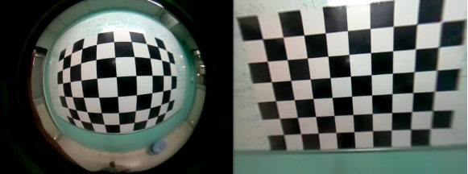
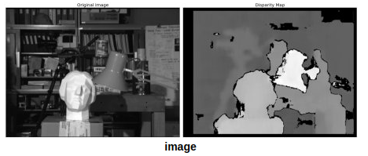
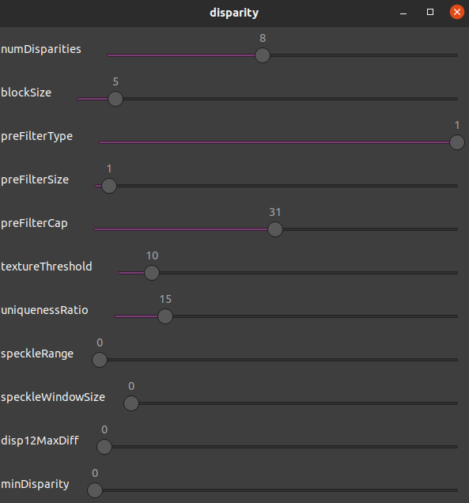

# Stereovision project
The main goals for this project was to write code to calibrate two cameras removing their distortion and create live disparity map using OpenCV library. 

## Calibration
Calibration of the cameras was performed with checkboard. First I took several pictures with checkboard in different locations and angles. Than using _cv::calibrateCamera_ I got calibration data which was saved to _xml_ file. Now taken images can be fixed using _cv::undistort()_ function.

## Disparity map
With unistorted images I could calculate disparity using the StereoBM algorithm using _stereo->compute()_ function. To improve visablity I used interactive trackbars to tune algorithm parameters.

